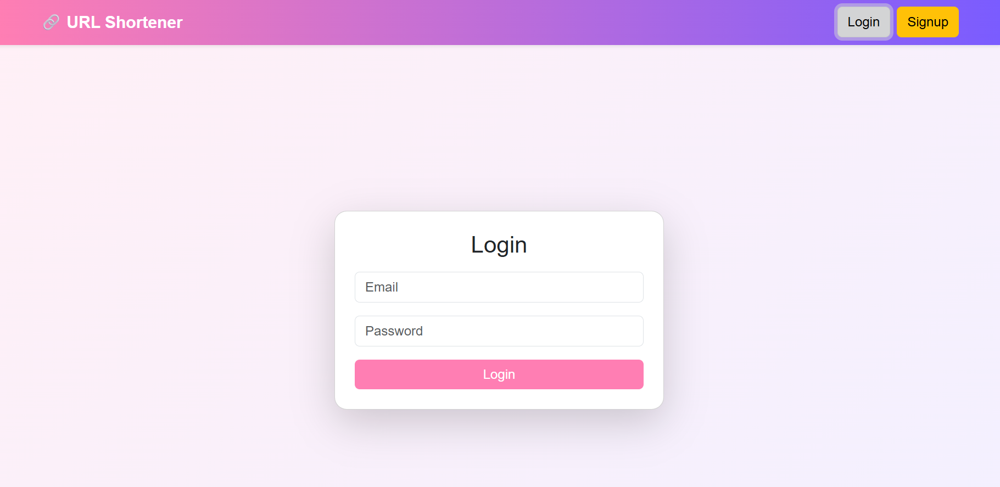
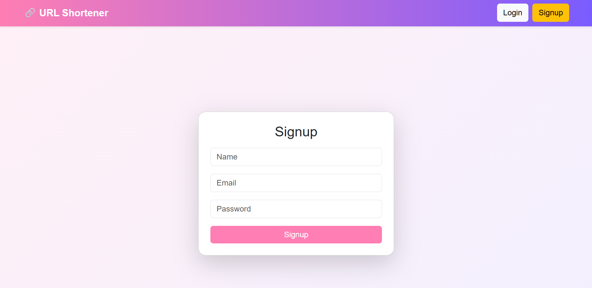
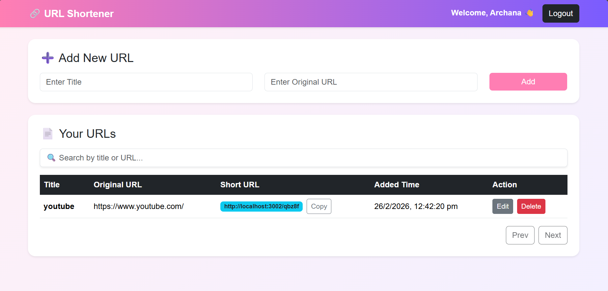

# 🔗 URL Shortener Web Application

A responsive URL Shortener application built using React.js that allows users to create accounts, shorten URLs, and manage them with features like authentication, search, pagination, and CRUD operations.

---

## 🚀 Features

* User Signup and Login
* Local Storage session persistence
* Add, edit, and delete URLs
* Automatic short URL generation
* Search and pagination
* Copy to clipboard
* Responsive UI with Bootstrap

---

## 🛠️ Technologies Used

* React.js
* JavaScript 
* Bootstrap 5
* React Router DOM
* HTML5 & CSS3
* Local Storage

---

## 📂 Project Structure

```
src/
│── pages/
│   ├── Login.js
│   ├── Signup.js
│   ├── Dashboard.js
│   ├── AddUrl.js
│   └── UrlList.js
│
│── Navbar.js
│── App.js
│── index.js
│── App.css
```

## 📸 Screenshots

### 🔐 Login Page


### 📝 Signup Page


### 📊 Dashboard



