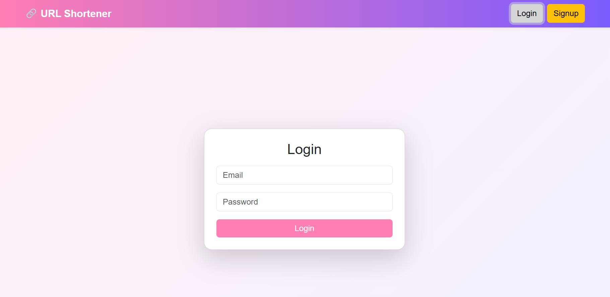
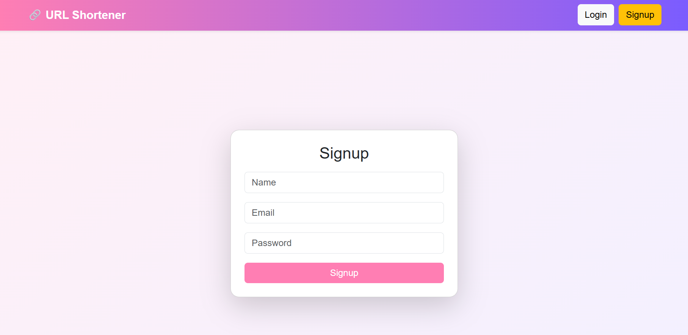
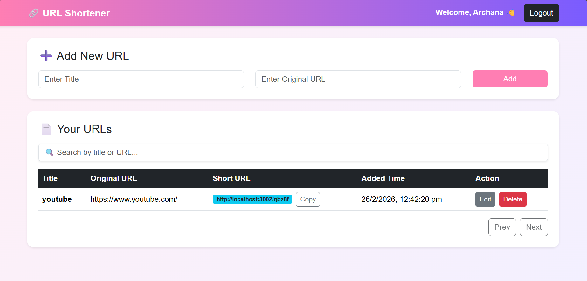

# 🔗 URL Shortener Web Application

A modern URL Shortener web application built using React that allows users to create accounts, generate shortened links, and manage them efficiently with features like authentication, search, pagination, edit, and delete.

This project demonstrates front-end development skills, state management, routing, and local storage handling.

---

##  Features

* User Signup & Login Authentication
* Generate Shortened URLs
* Redirect Short Links to Original URLs
* Dashboard to Manage URLs
* Search Functionality
* Pagination
* Edit & Delete URLs
* Copy Short Link to Clipboard
* Responsive UI with Bootstrap
* Data Persistence using LocalStorage

---

##  Technologies Used

* React.js
* JavaScript 
* Bootstrap 
* React Router DOM
* HTML & CSS
* Local Storage (Client-side database)

---

##  Project Structure

```
src/
 ├── pages/
 │    ├── Login.js
 │    ├── Signup.js
 │    ├── Dashboard.js
 │    ├── AddUrl.js
 │    ├── UrlList.js
 │    └── Redirect.js
 │
 ├── Navbar.js
 ├── App.js
 ├── App.css
 └── index.js
```

---

##  How It Works

1. User signs up and logs in.
2. User adds a URL with a title.
3. App generates a unique short ID.
4. Short link redirects to original URL using routing.
5. Data is stored in localStorage for persistence.

---

##  Screenshots

###  Login Page


###  Signup Page


###  Dashboard


---
### *Future Improvements*

* Backend integration (Django)
* Database storage
* Link expiration
* Deployment with public domain

